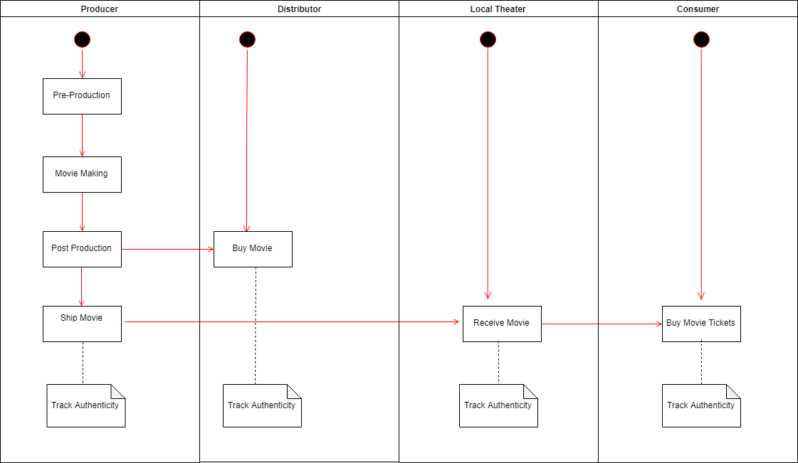
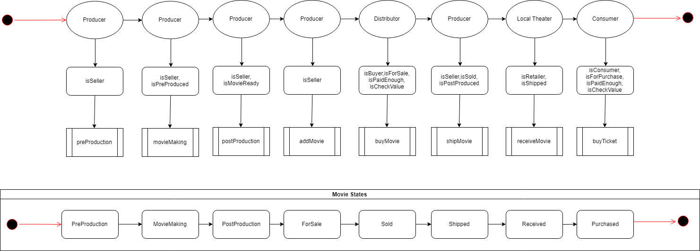
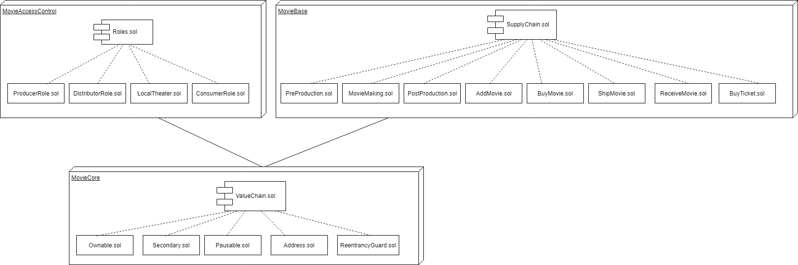
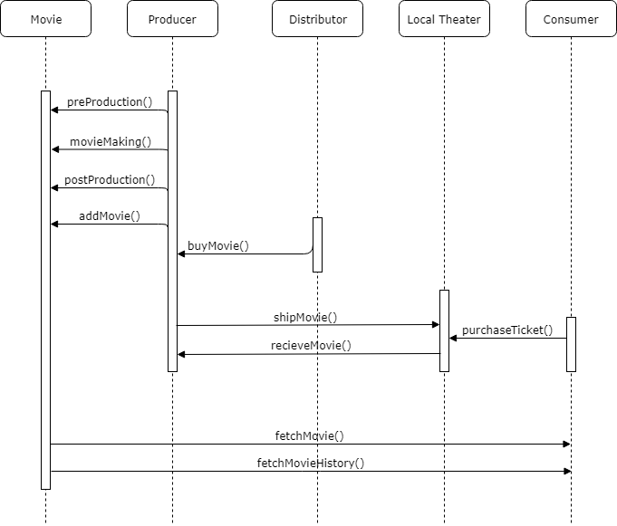

# Movie Supply Chain Dapp

This repository containts an Ethereum DApp that demonstrates a Supply Chain flow between a Seller and Buyer. The user story is similar to any commonly used supply chain process. A Seller can add items to the inventory system stored in the blockchain. A Buyer can purchase such items from the inventory system. Additionally a Seller can mark an item as Shipped, and similarly a Buyer can mark an item as Received.

## Project write-up 
### UML

### Libraries
No external libraries have been used. Frameworks version:
- Truffle v4.1.15 - a development framework for Ethereum
- Node v10.13.0
- Ganache CLI v6.4.5 (ganache-core

## Part 2: Write smart contracts
In order to create your supply chain DApp, you will need to properly manage user permissions and track a product’s authenticity.

The smart contract(s) you build should have these requirements:

###  Requirement 1 	Define and implement interfaces: 
Review all the files. Add in any interfaces you use. 

### Requirement 2 	Build out AccessControl Contracts: Build out these contracts so that each actor’s role in your supply chain is distinct with no overlap in their access abilities. 
The Following contracts were created, inheriting from Role.sol:  
    ProducerRole.sol (already existed as FarmerRole.sol): The Producer can create new movies through Pre-Production, MovieMaking and Post-Production them until ready for Sale them and track authenticity.
    DistributorRole.sol: The Distributor can buy Movies and track authenticity.
    LocalTheaterRole.sol: The LocalTheater can receive movies shipped from producer after being bought by Distributor and track authenticity.
    ConsumerRole.sol: The Consumer can buy tickets from local theater and track authenticity
   
### Requirement 3 	Build out Base Contract
    Base - SupplyChain.sol: This is where we define the most fundamental code shared throughout the core functionality. This includes our main data storage, constants and data types, plus internal functions for managing these items.

### Requirement 4 	Build out Core Contract
    Core - Ownable.sol: is the contract that controls ownership and transfer of ownership.

## Part 3: Test smart contract code coverage
Requirement: Smart contract has associated tests

Every function  implemented from your Sequence Diagram was tested:
*  Smart contract function 'preProduction()' that allows a Producer to create a Movie
*  Smart contract function 'movieMaking' that allows a Producer to mark an movie 'Process'
*  Smart contract function 'postProduction' that allows the Producer to mark an item 'Ready'
*  Smart contract function 'addmovie' that allows a Producer to mark an item 'ForSale'
*  Smart contract function 'buyMovie' that allows the Distributor to mark an item 'Sold'
*  Smart contract function 'shipMovie' that allows the Producer to mark an item 'Shipped'
*  Smart contract function 'receiveMovie' that allows the Local Theater to mark an item 'Received'
*  Smart contract function 'buyTicket' that allows the Consumer to mark an item 'Purchased'
*  Smart contract function fetchItemBufferOne() that allows anyone to fetch item details from blockchain
*  Smart contract function fetchItemBufferTwo() that allows anyone to fetch item details from blockchain

